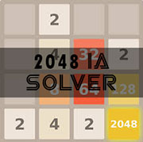
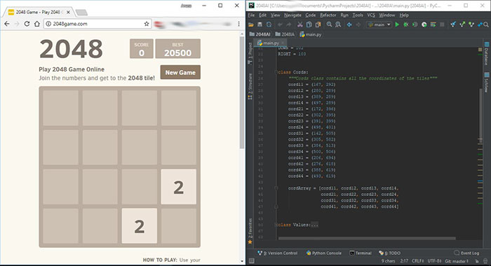

# 2048GameAI



> Basic IA to solve [2048 game](http://2048game.com).

## Getting Started

* Get the script.

```
1. git clone https://github.com/xusakos/2048GameAI
2. cd 2048GameAI
3. pip install .
```
or simply download the code to your project folder.

### Set it up yourself with this Basic Setup

1. Open the web page of the [2048 game](http://2048game.com).

2. Put the windows of the navigator to the left of your desktop like in the image:


3. find the cursor coordinates of every tiles using the function :
```
if __name__ == '__main__':
    getPixelPosition()
```
note : execute this function for each tile, don't forget to put the mouse cursor on the down left corner of the tile.

4. Save the coordinate of each tile in the appropriate variable:
```
class Cords:
    """Cords class contains all the coordinates of the tiles"""
    cord11 = (167, 292)
    cord12 = (280, 289)
    cord13 = (389, 289)
    cord14 = (497, 289)
    cord21 = (172, 396)
    cord22 = (302, 395)
    cord23 = (391, 399)
    cord24 = (498, 401)
    cord31 = (142, 505)
    cord32 = (305, 582)
    cord33 = (384, 513)
    cord34 = (500, 506)
    cord41 = (206, 694)
    cord42 = (276, 618)
    cord43 = (388, 619)
    cord44 = (493, 619)

    cordArray = [cord11, cord12, cord13, cord14,
                 cord21, cord22, cord23, cord24,
                 cord31, cord32, cord33, cord34,
                 cord41, cord42, cord43, cord44]
```
5. run the script.

## Authors

* **Anass TAHA** - *Initial work* - [Author](https://github.com/xusakos/).

## License

Free to use.
